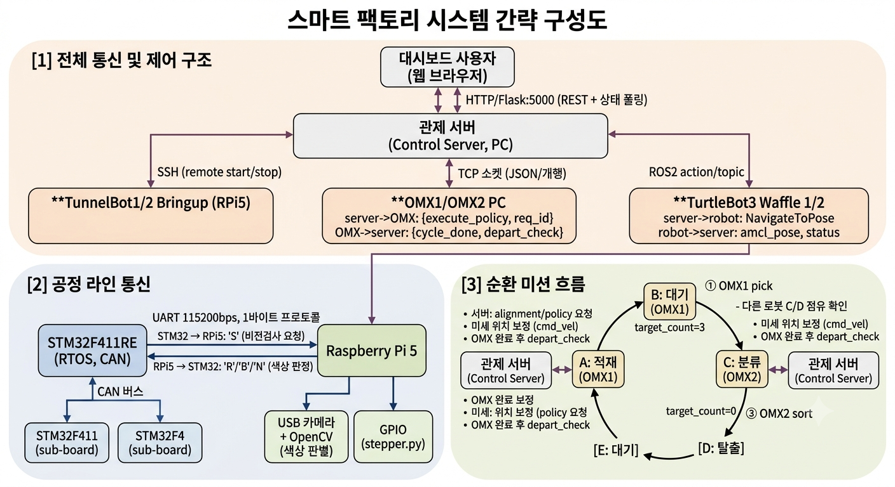
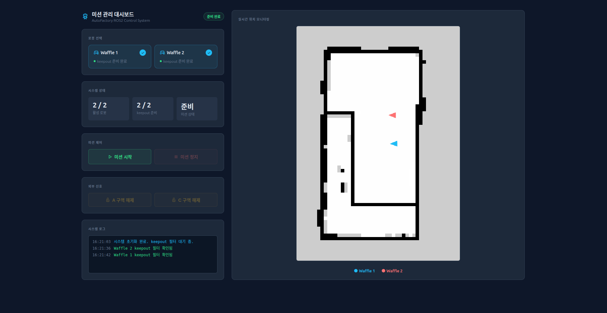

# 💊 Smart Factory — 제약 패키징 자동화 시스템

> 알약 검사부터 포장·적재·분류까지, 전 공정을 자동화한 스마트팩토리 프로젝트입니다.
> STM32 분산 제어 · 라즈베리파이 비전 · ROS2 관제 · TurtleBot3 자율주행 · OpenManipulator-X 모방학습을 하나의 파이프라인으로 통합했습니다.

  
  
  
  
  

---

## 🏭 시스템 개요

알약 병이 컨베이어에 투입되면 다음 순서로 처리됩니다.

1. **공급 & 비전 검사** — 컨베이어가 병을 비전 구역으로 이송하고, 라즈베리파이가 OpenCV로 색상/양품을 판정합니다.
2. **약통 공급** — 판정 결과에 따라 TB6600 스테퍼가 알약을 정량 공급합니다.
3. **뚜껑 공급 · 압착 · 분류** — 뚜껑을 씌우고 압착한 뒤 색상별로 분류합니다. (2개 공정 병렬 처리)
4. **자율 이송** — TurtleBot3가 지정된 웨이포인트를 순회하며 완제품을 이송합니다.
5. **적재 & 분류** — OpenManipulator-X가 모방학습 정책으로 트레이에 적재/분류합니다.

전체 공정은 **ROS2 관제 서버 + 웹 대시보드**에서 실시간으로 모니터링·제어됩니다.

---

## 🗂️ 저장소 구조

| 디렉터리 | 역할 | 문서 |
|---|---|---|
| [`STM32/`](STM32) | 3개 보드 분산 제어 펌웨어 (F411 · MCP2515 CAN 버스) | [PIN_LAYOUT](STM32/PIN_LAYOUT.md) |
| [`raspi/`](raspi) | 라즈베리파이 5 비전 검사 + STM32 UART 핸드셰이크 | [README](raspi/README.md) |
| [`server/`](server) | ROS2 관제 서버 · Flask/SSE 대시보드 · 미션 관리 | [README](server/README.md) |
| [`omx/`](omx) | OpenManipulator-X 모방학습 실행 서버 · 트레이 카운팅 | [README](omx/README.md) |
| [`turtlebot/`](turtlebot) | TurtleBot3 Waffle Nav2 자율주행 | [README](turtlebot/README.md) |
| [`docs/`](docs) | 이미지 · 진행 로그 · 중간 발표 자료 | — |

---

## ⚙️ 구성 요소

### 🔧 STM32 — 분산 제어 (3-보드 CAN 버스)

세 개의 STM32F411 보드가 **MCP2515 CAN 버스**로 연결되어 각자 공정을 담당하고, FreeRTOS 태스크로 동시성을 처리합니다.

| 보드 | 담당 공정 |
|---|---|
| **Board 1** | 컨베이어 벨트·공급 제어, 비전 검사 트리거, 검사 결과 CAN 브로드캐스트 (`0x101`) |
| **Board 2** | 약통 공급 (TB6600 스테퍼 드라이버 + 가감속 제어) |
| **Board 3** | 뚜껑 공급 · 압착 · 색상 분류 (2개 공정 병렬, 서보 PWM + L298N) |

> 물리 배선 정보는 [`STM32/PIN_LAYOUT.md`](STM32/PIN_LAYOUT.md)를 참고하세요.

### 👁️ Raspberry Pi — 비전 검사

라즈베리파이 5가 USB 카메라로 병을 촬영해 OpenCV로 양품/색상을 판정하고, STM32와 **UART 유선 핸드셰이크**로 결과를 주고받습니다. (결선 정보는 [raspi/README](raspi/README.md))

### 🖥️ Server — ROS2 관제 & 대시보드

ROS2 Jazzy 기반 `server_pkg`가 전체 공정을 오케스트레이션하고, Flask + SSE 웹 대시보드에서 제어합니다.

- 로봇을 선택해 공정에 투입 (TurtleBot 1대만 또는 2대 모두)
- 공정 중 로봇을 중단하고 중단 지점에서 재개
- 맵에 로봇 현위치 실시간 반영

### 🤖 TurtleBot3 — 자율주행

Nav2 기반으로 설정된 웨이포인트를 순서대로 순회하며, 특정 포인트 도달 시 정지 후 외부 신호를 받아 주행을 재개하는 **조건부 대기** 로직을 갖췄습니다.

### 🦾 OpenManipulator-X — 모방학습

lerobot 기반 모방학습 정책으로 적재/분류를 수행합니다.

| 로봇 | 공정 | 정책 |
|---|---|---|
| OMX1 | 적재 (A) | **ACT** |
| OMX2 | 분류 (C) | **Diffusion** (DDIM, 추론 스텝 override) |

트레이 카운팅(OpenCV)으로 출발 조건을 판정하며, 각 PC별로 카운터 모듈을 분리해 독립 튜닝했습니다.

---

## 🛠️ 하드웨어

- STM32F411 × 3 · MCP2515 CAN 트랜시버
- Raspberry Pi 5 + USB 카메라
- TB6600 스테퍼 드라이버 · NEMA17 · L298N 모터 드라이버 · 서보
- TurtleBot3 Waffle
- OpenManipulator-X × 2

## 💻 소프트웨어

`ROS2 Jazzy` · `FreeRTOS / CMSIS-RTOS v2` · `STM32 HAL` · `OpenCV` · `PyTorch / lerobot` · `Nav2` · `Flask + SSE`

---

## 👥 Team 3

7인 프로젝트 · 자동 알약 패키징 스마트팩토리
